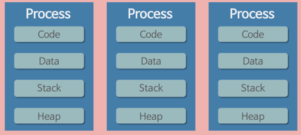
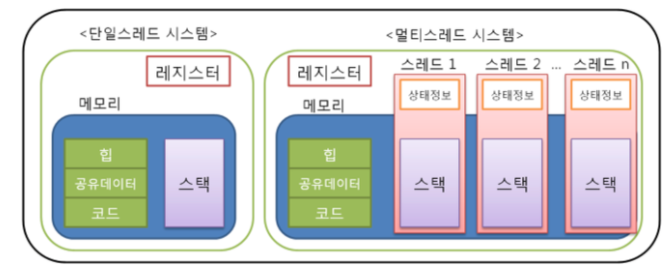
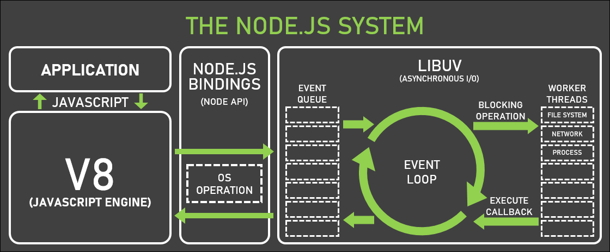

# Node JS란?

Javascript Runtime 입니다.

자바스크립트는 태초에 Browser에서 동작하는 script 언어였는데요

그것이 유일한 단점이었습니다.

브라우저에서만 사용가능한 언어는 한계가있으니까요.

브라우저에서 Javascript를 해석하는 녀석은 대표적으로 Chrome 브라우저에서 사용되는 V8 엔진이있습니다.(브라우저마다 상이합니다)

이 V8엔진은 C++ 언어로 만들어졌습니다. 이걸 그대로 브라우저에서 때내와서 Node 라는 환경에 가져다 놓아, 브라우저 밖, 즉 OS환경에서도

Javascript를 사용할 수 있게 되었습니다.

## NodeJS의 특징

- Javascript Runtime 이다
- Single Thread 이다
- Non-Blocking I/O 이다
- Event-Driven 방식을 사용한다

이렇게 크게 4가지로 볼 수 있습니다.

하나하나 자세히 볼까요?

### Javscript Runtime

자바스크립트를 해석하고 실행할 수 있는 V8엔진을 사용합니다.

### Single Thread

OS환경에서 돌아가는 프로그램 하나하나를 Process라고 합니다.

예를들면 Chrome, Vscode, 카카오톡 등을 실행하고있다면, 그것들이 각각 Process 입니다.

이런 Process는 동작하기위해서 Resource를 할당받습니다.

크롬이 돌아가기위해서 필요한 자원들, Vs코드를 실행하기 위한 자원들이 있겠죠?

그림과 같이 하나의 프로세스는 4개의 자원을 할당받습니다.

코드와, 데이터, 함수의 실행순서를 기억하는 Stack, 동적으로 생성한 객체들을 저장하는 Heap 메모리 입니다.

이런 자원을 가지고 일하는 녀석이 바로 Thread 입니다.

multi threading을 한다는 것은, 이렇게 Process마다 할당된 리소스 내에서, 또 분할을 하여 병렬 처리를 하는 것입니다.

하지만 이런방식이 유용하지만은 않습니다. 이런 Thread가 많이 생길수록 각각이 차지하는 리소스가 또 늘어나기때문에 메모리의 사용량이 늘어나고

여러개의 Thread들이 동작하는것은, 사실 빠르게 스케쥴링이 되어서 병렬동작하는거 처럼 보이는 것이기 때문에, 이런 스케쥴링에도 비용이 발생합니다.

또 멀티쓰레딩은 공유하는 자원에 접근할때의 충돌을 방지해야되기 때문에 상당히 까다로운 작업입니다.

떄문에, 멀티쓰레딩은 신중하게 하는것이 좋습니다.

### Non-Blocking I/o

이렇게 복잡한 멀티쓰레딩을 뒤로 해놓고, Node는 Single Thread로 동작합니다.

만약 단순히 single thread로 동작하면, 어떤 하나의 I/O처리에 기다림이 생기겠죠?

하나의 쓰레드는 동기적으로 동작하니까요

하지만 Thread가 동작하는 방식은 두가지가있습니다.

Blocking 과 Non-Blocking 입니다.

이중에서 node는 Non-blocking 방식을 사용하는데, I/O처리를 비동기적으로 Asynchronous 하게 처리하는 방식입니다.

이렇게 된다면 하나의 Thread는 I/O 동작을 할때, 여러 요청을 입력받고, 비동기적으로 File, Database, Network 등 처리를 하는 것이죠

### Event-Driven

그리고선 하나의 I/O 처리에 callback을 함께 전달합니다.

비동기적으로 요청해두었던 I/O처리가 발생한다면 event가 발생하는데, 이 event가 발생하면 함께 전달했던 callback을 실행하도록 하는 것입니다.

이것이 바로 event driven 방식입니다.

그럼, event driven이 어떻게 동작하는 것인지 자세히 살펴볼까요?

그림과 같이 우리가 작성한 js파일이 application에 해당합니다.

이것을 V8엔진이 해석을하고, 코드를 실행하죠

우리가 코드상에서 Node API(file,OS,Stream,setTimeout,Promise..)를 사용하게되면 Node가 처리하는 방식대로 I/O처리를 하게됩니다.(앞서 설명한 Non-blocking 방식으로)

> 우리는 OS를 직접 조작하지 않기때문에, 우리는 javascript로 High Level로 코딩을하게됩니다.

예를들어서 file하나를 만든다고 합시다. 그러면 Node API 중 file을 조작하도록 도와주는 모듈을 사용하게 됩니다.

그러면 Node는 OS에 접근해서 파일시스템을 조작하겠죠? 우리가 이것을 전달할때 , 해당 I/O 동작 event에 callback을 걸어놓습니다.

콜백의 내용은 "파일에 접근했다면 hello라는 문자열을 입력한다" 라고한다면, Node는 File에 접근하고나서는 우리의 callback을 실행하도록

callback 함수를 우리 main 어플리케이션의 Stack에 쌓습니다.

우리가 이 동작을 하면서 어떻게 이동했나요? App의 Stack -> Node API -> OS -> event 발생 -> App에 callback 전달 이렇게 순회를 했죠?

이게 바로 Node 의 event Driven 방식입니다.

App입장에서는 Stack에서 Node API로 함수를 전달했기때문에, 다른 코드를 읽으며 동작을 이어나갈수 있게되었죠, 즉, 비동기 동작을 한것입니다.

하나의 I/O동작을 기다리지않고, 하던일 하면서 이벤트가 발생하면 그때 다시 특정 동작을 하는것이죠

그림에는 오른쪽 이벤트 루프가 돌아가는 Node 환경에 LIBUV 라고 되어있는데 이것은 C언어로 만들어진 non-blocking 처리를 하도록 해주는 라이브러리입니다.

Node의 구성요소중 하나인것이죠. 이것덕분에 I/O처리를 비동기적으로 할수있는 것입니다.

> Node 12 버전이상에서는 App 단에서 worker thread를 만들어서 multi threading을 조작할 수 도있게 되었습니다

이외에도 node를 구성하는 다양한 모듈이 있는데, llhttp 는 http를 파싱하는 모듈, openSSL은 tls,crypto, zlib 은 데이터압축,해제를 도와주죠

## 정리

- I/O 동작을 할때는 non-blocking과 event-driven 방식으로 동작하는 Node가 multithreading 을 사용하는 환경보다 좋다.
- 하지만 Singthread 이기 떄문에, 무거운 CPU 작업을 할때는 좋지않다.(전달된 callback도 결국 app에서 실행되기 때문에, 하지만 worker thread를 지원하기 때문에 어느정도 극복이 가능하다)