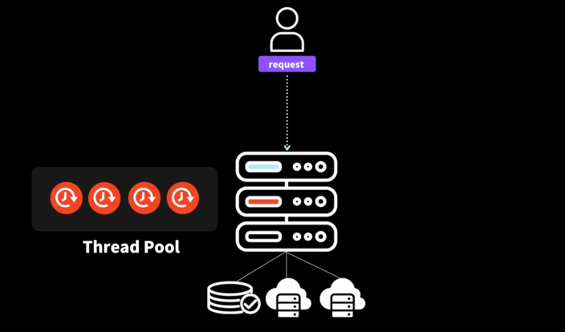

# Node Server 의 특징과 장단점

## Traditional Server(전통적인 서버)

전통적인 서버라고 함은,옛날부터 그리고 현재까지 사용되고 있는 서버의 동작방식을 말합니다.

서버를 구성하는 방법은 크게 두가지로 볼수있겠는데요

1. 서버내에 DB를 함께 내장하는 구조 (일체형)
2. 서버는 서버대로, DB는 또다른 클라우드에 두는 형태 (분리)

그림과 같이 서버와 DB가 연결되어있는 구조를 생각해봅시다.

서버는 1대의 PC입니다. 하나의 PC는 I/O 처리를 하기위한 thread가 있겠죠?

자신이 가질수있는 가능한 모든 thread를 thread pool이라는 곳에 저장하고있습니다.

그림에는 총 4개가 보이죠. 서버는 하나의 request에 대해서 하나의 thread를 할당하여 사용합니다.

이 서버는 4개의 요청까지는 동시에 처리할 수 있지만, 5개이상부터는 가용한 thread가 없기때문에 대기 시간을 가져야합니다.

Thread 를 사용하는 서버가 대표적으로 Java 동작하는 서버이죠

## Node Server

노드는 어떻게 동작한다고 했었나요? 바로 single Thread 이죠?

그렇다면 하나의 요청씩만 받아서 처리할 수 있는걸까요?

그렇지 않습니다. Node는 I/O처리를 non-blocking 방식으로 처리하기 떄문에 하나의 thread는 무수히 많은 요청을 받아도

그 요청을 모두 OS로 던져버리게되죠

이게 바로 Node 서버의 장점입니다. 수많은 요청을 대기열없이 처리할 수있다는 장점입니다.

허자만 동시에 단점도 존재합니다.

single thread이기 때문에, 무거운 CPU작업에서는 병렬적으로 처리하지 못하니 느리게 됩니다.

이를 극복하기위해선 여러방식이있는데요

1. 분산 서버를 둔다
2. AWS lamda 사용
3. google cloud function

등을 사용해서 연산처리를 분산해서 하는 방식이 있습니다

