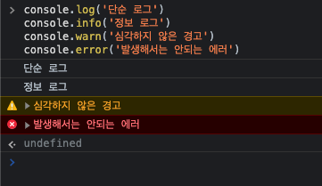
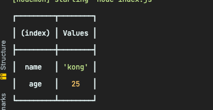

## console 의 진실

console.log 많이사용하시죠?

보통 console 메서드중 log 단하나만을 많이 사용하실 거같은데요. 저두 그랫구요!


하지만 때에 따라서 적절히 다른 메서드를 사용하면 좀더 유용하게 200프로 활용할 수 있을 겁니다.

특히, console.log, console.info, console.warn(), console.error() 들은 서버를 개발하고 나서

이러한 Level 별로 컨트롤하는 라이브러리를 사용하기도해서 유용합니다.

## Level 별 console

```js
console.log('단순 로그')
console.info('정보 로그')
console.warn('심각하지 않은 경고')
console.error('발생해서는 안되는 에러')
```



## console 의 정의 부분

cosnole을 커맨드키와 함께 눌러보면 선언부로 이동합니다.

앞서 설명한 것들보다 훨씬 많은 메서드들을 가지고 있습니다.

그중 유용한 몇가지를 소개해드리겠습니다.

```ts
interface Console {
    assert(condition?: boolean, ...data: any[]): void;
    clear(): void;
    count(label?: string): void;
    countReset(label?: string): void;
    debug(...data: any[]): void;
    dir(item?: any, options?: any): void;
    dirxml(...data: any[]): void;
    error(...data: any[]): void;
    group(...data: any[]): void;
    groupCollapsed(...data: any[]): void;
    groupEnd(): void;
    info(...data: any[]): void;
    log(...data: any[]): void;
    table(tabularData?: any, properties?: string[]): void;
    time(label?: string): void;
    timeEnd(label?: string): void;
    timeLog(label?: string, ...data: any[]): void;
    timeStamp(label?: string): void;
    trace(...data: any[]): void;
    warn(...data: any[]): void;
}
```

### console.table()

Object를 좀더 가시적으로 볼 수 있습니다.

```js
const kong  = {name:'kong',age:25}
console.table(kong)
```



### console.assert()

조건 부로 console을 출력합니다. 첫번째 인자가 false 일시 두번째 인자를 출력합니다.

```js
const kong  = {name:'kong',age:25}
console.assert(kong.age < 4,kong.age); // 출력
console.assert(kong.age < 4,kong.age); // 출력하지 않음
```

### console.time(), console.timeEnd()

시작과 끝을 고정해두고, 그 사이 시간을 반환합니다.

즉, 코드 실행시간을 확인 할 수 있습니다.

```js
console.time('for loop') // 측정 시작
for (let i =0;i<100;i++){

}
console.timeEnd('for loop'); // 측정 종료

// for loop: 0.068ms

```

### console.count()

해당 console이 얼마나 호출되었는지 출력합니다.

예를 들면 어떤 함수에 같이 담아두면 그 함수가 몇번 호출되었는지 알 수 있겠죠?

> console.countReset() 으로 횟수를 초기화 할 수도있습니다.

```js
for (let i =0;i<100;i++){
    console.count('얼마나')
}

// 얼마나: 1
// .
// .
// 얼마나: 95
// 얼마나: 96
// 얼마나: 97
// 얼마나: 98
// 얼마나: 99
// 얼마나: 100

```

### console.trace()

콘솔이 호출되기 까지 거친 호출스택을 모두 알려줍니다

가끔 코딩하다가 에러떠서 많이본 장면일겁니다

```js
function f1(){
    f2()
}

function f2(){
    f3()
}

function f3(){
    console.trace()
}

f1()

// Trace
// at f3 (/Users/gongtaemin/Documents/노드에대한 모든것/4-console/index.js:10:13)
// at f2 (/Users/gongtaemin/Documents/노드에대한 모든것/4-console/index.js:6:5)
// at f1 (/Users/gongtaemin/Documents/노드에대한 모든것/4-console/index.js:2:5)
// at Object.<anonymous> (/Users/gongtaemin/Documents/노드에대한 모든것/4-console/index.js:13:1)
//     at Module._compile (node:internal/modules/cjs/loader:1101:14)
//     at Object.Module._extensions..js (node:internal/modules/cjs/loader:1153:10)
//     at Module.load (node:internal/modules/cjs/loader:981:32)
//     at Function.Module._load (node:internal/modules/cjs/loader:822:12)
//     at Function.executeUserEntryPoint [as runMain] (node:internal/modules/run_main:81:12)
//     at node:internal/main/run_main_module:17:47

```

친절하게 어디서 몇번째줄에서 발생한건지도 다 알려줍니다