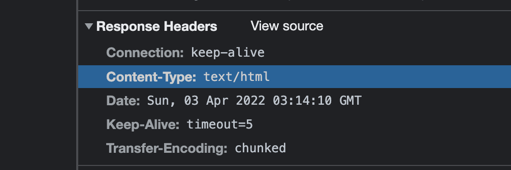

## 기본골격

```js
const http = require("http");

const server = http.createServer((req, res) => {
  console.log("incoming...");
  console.log(req.headers);
  console.log(req.httpVersion);
  console.log(req.method);
  console.log(req.url);
  res.write("welcome!");
  res.end();
});

server.listen(8080);
```

## html 파일을 읽어서 전송

```js
const http = require("http");
const fs = require("fs");

const server = http.createServer((req, res) => {
  const url = req.url;

  if (url === "/") {
    const buff = fs.readFileSync("./index.html");
    res.write(buff);
  }
  res.end();
});

server.listen(8080);
```

## header 설정해보기

```js
if (url === "/") {
  const buff = fs.readFileSync("./index.html");
  res.setHeader("Content-Type", "text/html");
  res.write(buff);
}
```



> header를 명시할 경우 chrome에서 Resopnse header에 추가된 것을 확인해 볼 수있다

## stream을 이용해서 전달해보기

> res.end()는 제거해주어야합니다. stream은 동기적으로 처리되는 것이 아니기 때문에, end를 작성한다면, stream으로 완전히 전달되기 전에 end가 호출되면서 응답을 수행을 제대로 하지 못합니다.

```js
const http = require("http");
const fs = require("fs");

const server = http.createServer((req, res) => {
  const url = req.url;

  res.setHeader("Content-Type", "text/html");
  if (url === "/") {
    fs.createReadStream("./html/index.html").pipe(res);
  } else {
    fs.createReadStream("./html/not-found.html").pipe(res);
  }
});

server.listen(8080);
```

## templates(ejs) 사용해서 SSR 만들어보기

ejs 는 php와 같이 html에 내장된 javascript구분을 해석하는 도구입니다.

지금은 메모리상에서 username, dataList를 보내주고있지만, 이를 node환경에서 database와 연결하고, 값을 전달해주면 일반적인 SSR이 되는것입니다.

> 여기서 ejs.renderFile()은 Ejs파일을 해석한후 data로 반환합니다. 그 data를 res 로 보내주면 되는것입니다. write()를 생략하고 단순히 res.send(data) 이렇게 해주어도 됩니다.

```js
const http = require("http");
const fs = require("fs");
const ejs = require("ejs");

const server = http.createServer((req, res) => {
  const url = req.url;

  if (url === "/") {
    ejs
      .renderFile("./templates/index.ejs", { username: "kong", dataList: ["html", "css", "js", "node"] })
      .then((data) => {
        res.write(data);
        res.end();
      });
  } else {
    fs.createReadStream("./html/not-found.html").pipe(res);
  }
});

server.listen(8080);
```

### index.ejs

```html
<!DOCTYPE html>
<html lang="en">
  <head>
    <meta charset="UTF-8" />
    <meta http-equiv="X-UA-Compatible" content="IE=edge" />
    <meta name="viewport" content="width=device-width, initial-scale=1.0" />
    <title>Document</title>
  </head>
  <body>
    <h1>Welcom! <%= username %></h1>
    <p>안녕하세요 저는 그냥 기본 http 모듈이에요!</p>
    <ul>
      <% dataList.forEach(item => { %>
      <li><%= item %></li>
      <% }); %>
    </ul>
  </body>
</html>
```

## body

우리가 데이터를 주고받을 때는 string데이터 타입을 사용합니다.  
단순히 문자열이면 제한사항이 많겠죠

그래서 등장한 것이 JSON 타입입니다.

형태는 string이지만 \[\], {}, (),"" 등의 기호들로 구분을하여  
데이터를 전송하고, 받을 때 parsing하여 다양한 형태의 자료형를 전달할 수 있습니다.

> JSON에 대한 자세한설명은 생략하도록 하겠습니다.

이전까지 작성한 http 서버에서는 단순히 html파일만을 전달했습니다.

이는 브라우저 클라이언트만 사용이 가능한 형태이죠

만약 다른 디바이스, 앱이나, 다른 서버에서 데이터를 요청한다면 html말고 json의 형태로 제공해주면 좋겠죠?

http요청에서 url에 담기 애매하거나, 그러지 못하는 것들을 body에 담아서 보내곤 합니다.

순수한 vanilla nodeJS에서 http모듈은 어떻게 body를 읽어내는지 알아봅시다.

## POST요청의 body 읽기

> 상황은 서버에있는 courses 데이터 배열에 POST로 새로운 course 를 추가한다고 가정하겠습니다.

## 예시코드 보기

```
const http = require("http");

const courses = [
  { id: 1, title: "html" },
  { id: 2, title: "css" },
  { id: 3, title: "js" },
  { id: 4, title: "node" },
];

const server = http.createServer((req, res) => {
  const url = req.url;
  const method = req.method;

  if (url === "/courses") {
    if (method === "GET") {
      res.writeHead(200, { "Content-Type": "application/json" });
      res.end(JSON.stringify(courses));
    } else if (method === "POST") {
      const buffers = [];
      req.on("data", (chunk) => {
        buffers.push(chunk); // <Buffer 7b 0a 20 20 20 20 22 69 64 22 3a 35 2c 0a 20 20 20 20 22 74 69 74 6c 65 22 3a 22 72 65 61 63 74 4a 53 22 20 20 20 20 0a 7d>
      });
      req.on("end", () => {
        const data = Buffer.concat(buffers);
        const json = JSON.parse(data);
        console.log(json);
        courses.push(json);
        res.statusCode = 201;
        res.end("done");
      });
    }
  }
});

server.listen(8080);
```

## request

요청에 대한 정보는 모두 req에 담겨있습니다.

req의 정의를 따라가다보면 결국 `stream.Readable`를 상속받고있는데요

stream형식이라는 것입니다. 그럼 stream은 on 이벤트가 존재했었죠.

그래서 req.on('data')이벤트를 가지고 바이너리 형태로 데이터를 모두 읽어들입니다.

이떄 들어오는 데이터들이 body에 담긴 값들입니다.

우리는 stream을 통해서 들어오는 buffer데이터들을 배열에 저장하고

on('end')이벤트가 발생하면 데이터에 담긴 모든 buffer들을 합쳐줍니다.

> POST요청을 할때 JSON데이터로 보냈습니다

그리고 이 데이터들은 JSON으로 보내졌었기 때문에, 바이너리 데이터들을 JSON 모듈을 이용해서

Object로 파싱합니다.

그 데이터를 서버에 존재하는 courses 배열에 추가해주면 됩니다.

## 정리

- 요청데이터는 stream 형태이다.
- 요청 데이터의 body는 binary형태로 들어온다.
- 그것을 파싱하여 읽어 들어여한다.
